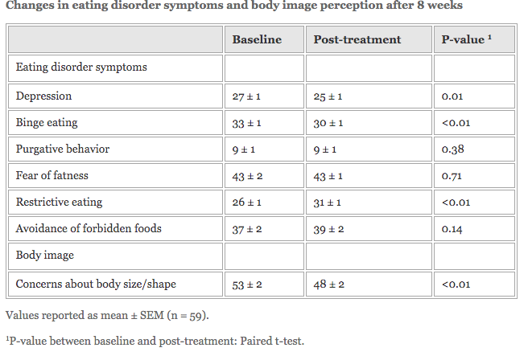

# What is Eating Disorders?

Disturbance in body image, over- or under- control of eating (severe dietary restriction or binging), and extreme behaviors to control bodyweight such as compulsive exercising or purging. 

Paper by the Canadian Paediatric Society on dieting in adolescence:

> “In many studies, chronic dieting (more than 10 diets in a year), fad dieting, fasting and skipping meals are also classified as unhealthy strategies.”
 

The current Diagnostic and Statistical Manual of Mental Disorders (DSM-IV) lists fasting among other forms of “Recurrent inappropriate compensatory behavior in order to prevent weight gain.”
 

## Is Intermittent Fasting different than Fasting?

[Safety of alternate day fasting and effect on disordered eating behaviors. - PubMed - NCBI](https://www.ncbi.nlm.nih.gov/pubmed/25943396/)
 

**Methods :**

- The 8- week, single-arm trial involved 59 subjects who completed the study out of the original 74 recruited.
- Body composition was assessed via dual X-ray absorptiometry (DXA).
- Subjects underwent a Varady-based ADF protocol, which consisted of ad libitum feeding days alternated with ‘fasting’ days consisting of 25% of predicted maintenance kcals.
- Fasting-day meals were provided for the subjects by the lab. All meals were eaten outside of the facility.
 
**Results** 

> Mean weight loss = 4.2kg 
Fat loss = 2.2 kg 
Lean mass loss = 2.0 kg

- Depression and binge eating actually decreased by the end of the trial, and so did concerns about body size/shape.
- Restrictive eating significantly increased (which the authors see as a positive thing for the goal of controlling unrestrained eating behaviors).
- Body image concerns decreased as well
 
 

## Overall, ADF performed favorably in terms of eating disorder safety.
 

**Limitations:** 

1. The adverse event questionnaire lacked comprehensiveness (it did not include questions about cold intolerance, hair loss, headaches, muscle cramps, difficulty concentrating, etc.).
2. Adverse effect assessment was binary; the intensity or magnitude of the adverse effects was not assessed. 
3. Most of the adverse event data were qualitative, and therefore were inherently subjective. 
4. The trial duration was relatively short (8 weeks), leaving open questions about longer-term effects. 
5. Finally, there was no control group on a conventional type of diet for comparative purposes. 
  
 
## Conclusion:

The study involved mature adults (age 25-65 years). Thus, caution is warranted against the presumption that younger age groups can do just as favorably as adults on ADF, or any other IF variant. 

Importantly, Hoddy et al’s subjects did not report any history or presence of an eating disorder. Individuals with a pre-existent eating disorder (or a suspected tendency towards disordered eating) should steer clear of diets that involve cycles of diet restriction, and this includes IF variants.

### To conclude, some individuals may take to IF well, while others might do very poorly. There’s still no magic, or universally superior diet.